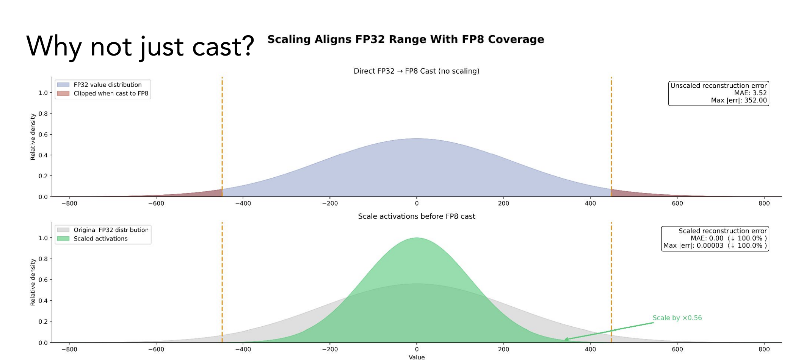

# Day 11: Why You Can't Just Cast to Low Precision

Welcome to Day 11 of the GPU Challenge!

Today I'm diving into [mxfp8, mxfp4, and nvfp4 formats in PyTorch](https://www.youtube.com/watch?v=Up0EfrudTSQ). It's a great primer from the Meta PyTorch team on how to actually use these new low-precision formats.

---

### Don't Cast, Scale

Can you just run `tensor.to(fp4)`?

**Absolutely not.** A standard Float32 tensor can represent 4 billion values. The new 4-bit dtypes can only represent **16**. If you cast directly, anything outside that tiny range gets clipped, leading to massive error rates (see Figure 1).

<b>Figure 1:</b> The reason why not just cast

The solution is **Scaling**. You need to normalize the data to fit the window. It is a critical technique used within the quantization process to preserve accuracy.

### Micro-Scaling (MX)

The industry is moving toward [Micro-scaling (MX) formats](https://arxiv.org/abs/2310.10537).

Instead of a single scale factor for an entire tensor (Per-Tensor) or row (Per-Row), microscaling divides the tensor into tiny blocks (e.g., 32 elements). It calculates a max value for just that block and scales the data to fit into the limited range (e.g., FP4's 16 representable values).

The scales for MX formats are stored in a unique type that consists solely of 8 exponent bits (no mantissa, no sign). This allows for efficient power-of-two scaling that stretches or compresses the data distribution to fit the target format.

### Fuse Scaling Kernel 

Naive Python implementations are slow.

Benchmarks on B200 GPUs show that if you don't fuse your operations, the memory overhead of managing these scales wipes out your gains. To get the theoretical 2x-4x speedups, **Kernel Fusion is mandatory**. You need to use `torch.compile` or write custom Triton kernels to fuse Quantization and MatMul into a single pass.

### Key Takeaway

Low precision is using everywhere if you care about efficiency, but it requires smart engineering. Don't just cast. You need to scale locally, and always fuse your kernels.