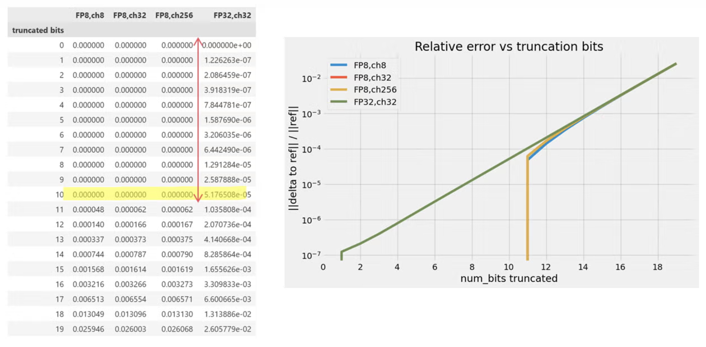
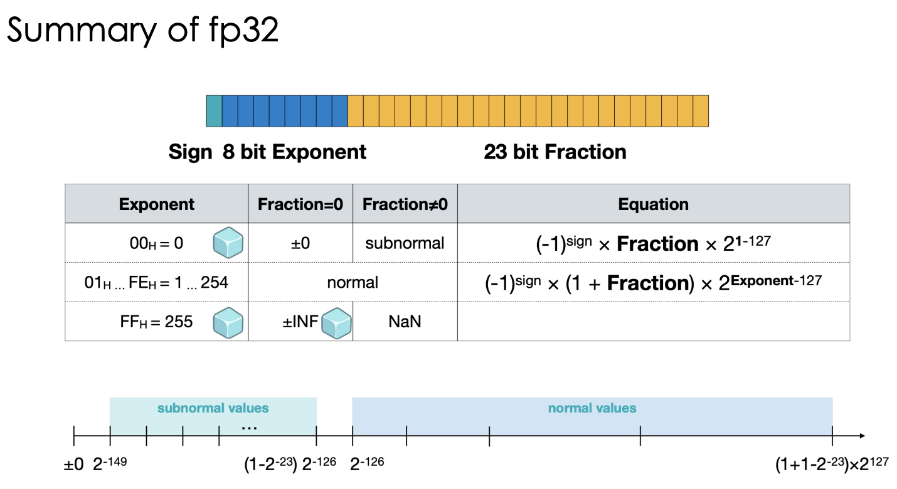

# Day 12: The Missing 10 Bits

### Reverse Engineering NVIDIA’s Tensor Core Precision

NVIDIA Hopper (H100) architecture often highlight **FP8 Matrix Multiplication with FP32 Accumulation**. However, recent [reverse engineering](https://pytorch.org/blog/some-matrix-multiplication-engines-are-not-as-accurate-as-we-thought/) by PyTorch team reveals that the "FP32" used inside the Tensor Core is actually not works as it claimed.

---

### Expected vs. Actual

In a standard FP32 (Single Precision) format, the bit layout is:

* **1 sign bit**
* **8 exponent bits**
* **23 mantissa bits (fraction)**

The experiment found that the Tensor Core's accumulator doesn't actually utilize all 23 bits of the mantissa.
It suggests that the accumulator is implemented using a special FP22 format (e8m13) for compute efficiency reasons

| Feature | Standard IEEE 754 FP32 | NVIDIA Tensor Core FP32 Accumulator |
| --- | --- | --- |
| **Exponent Bits** | 8 | 8 |
| **Mantissa Bits** | **23** | **~13** |
| **Effective Precision** | Full | Truncated (Missing 10 bits) |

---

### The Reverse Engineering Experiment

To verify this, the authors designed a "Kernel Match" experiment. They compared the matmul results of standard tensorcore accumulator against an accumulator with truncated precision. They found that the results remained identical even when up to 10 least significant mantissa bits were removed.

<b>Figure 1:</b> The error rate while increasing truncation bits

### Why Nvidia design this way?

The bottom 10 bits of the FP32 mantissa are ignored mainly due to hardware efficiency design tradeoff, that is, to save area and power on the silicon.

Speaking of hardware efficiency, I’d like to touch on the performance degradation associated with floating-point operations, as discussed in the paper ["Performance degradation in the presence of subnormal floating-point values."](https://charm.cs.illinois.edu/newPapers/05-12/paper.pdf)

Here is a quick recap of normal and subnormal floating-point values, as shown in Figure 2:

<b>Figure 2:</b> Summary of fp32

The problem is, the floating-point arithmetic unit cannot predict whether the results of a binary operation will result in a normal or subnormal value. As a result, it must first perform the computation, and if the results are too small to be expressed with a normal value, it goes into a special phase of operation to encode it into a subnormal value. This additional process will take more cycles, resulting in performance degradation.

### Learnings

This reminds us that high-performance kernel development is dictated by the hardware's internal architecture. It's our responsibility to know exactly how computation happens under the hood.

### Suggested Readings

1. [**UCSD CSE234 Week 5 Quantization**](https://hao-ai-lab.github.io/cse234-w25/)