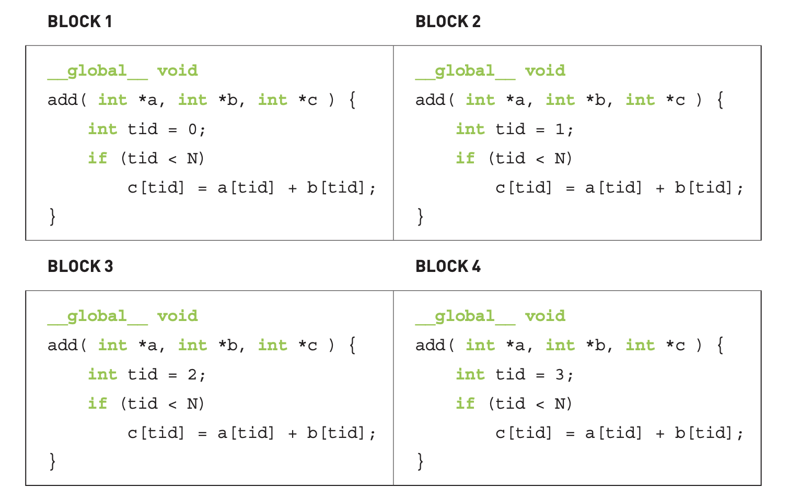

# Day 3: From Theory to Practice - Writing Your First CUDA Kernel

Welcome to Day 3 of the GPU Challenge!

On **Day 1**, we met our GPU monster and learned that we must feed it high-density, compute-bound food to keep it happy. On **Day 2**, we zoomed out to see the three-story building of an LLM system, understanding where our kernel-level work fits into the grand architecture.

Today, we roll up our sleeves and descend into the basement—the Kernel Layer. It's time to stop talking about theory and start writing the code that speaks directly to the GPU. We're going to write our very first CUDA kernel.

Our guide for this journey is the classic book, [*"CUDA by Example: An Introduction to General-Purpose GPU Programming"*](https://www.amazon.com/CUDA-Example-Introduction-General-Purpose-Programming/dp/0131387685). It's an older, foundational text, but the core concepts are timeless. It provides the perfect "Hello, World!" for anyone starting with GPU programming. While some examples might feel more domain-specific than modern ML systems, mastering these fundamentals is the first step to taming the beast.

### The Two Brains: Host and Device

The first mental model to grasp is that your computer now has two brains working together:

*   **The Host:** The CPU. This is the general-purpose manager. It runs your main program logic, prepares data, and gives instructions.
*   **The Device:** The GPU. This is the specialized parallel-processing powerhouse. It waits for the Host to give it a specific, massive task to execute across its thousands of cores.

They are separate entities with their own memory. The Host cannot directly access the Device's memory, and vice-versa. This separation is the source of many challenges and is why the `cudaMemcpy` function is so important.

### Our First Kernel: More Than Just a "Function"

Let's start with a simple program. In standard C, you'd write a `main` function. In CUDA C, which is a superset of C, you can do that too. But the real magic comes from the **kernel function**.

A kernel is a function that the Host calls but the **Device executes**. You mark a function as a kernel with the `__global__` qualifier.

```c++
// A simple kernel that does nothing
__global__ void myFirstKernel() {
    // This code runs on the GPU
}

int main() {
    // This code runs on the CPU
    
    // Now, we launch the kernel on the GPU
    myFirstKernel<<<1, 1>>>();
    
    // Wait for the GPU to finish its work before the program exits
    cudaDeviceSynchronize(); 
    
    return 0;
}
```

Two new things appeared here:

1.  `__global__ void myFirstKernel()`: The `__global__` keyword is a message to the NVCC compiler: "Compile this function to run on the GPU."
2.  `myFirstKernel<<<1, 1>>>()`: This strange-looking syntax is the **kernel launch**. The host is telling the device: "Execute `myFirstKernel` using 1 block of 1 thread." We'll unpack the `<<<...>>>` part soon. For now, think of it as the "Go!" signal.

### A GPU Can't Work Without Data

A kernel that does nothing isn't very useful. Let's write one that adds two numbers. But where do those numbers live? Remember, the Host and Device have separate memories.

To perform a calculation on the GPU, we must follow a standard four-step pattern:
1.  **Allocate Memory on the Device:** Use `cudaMalloc()` to reserve space in the GPU's memory.
2.  **Copy Data from Host to Device:** Use `cudaMemcpy()` to move input data from the CPU's RAM to the GPU's VRAM.
3.  **Launch the Kernel:** The GPU executes the kernel, operating on the data now local to it.
4.  **Copy Results from Device to Host:** Use `cudaMemcpy()` again to bring the results back to the CPU so we can see them.

Here's how it looks in code, adding `2 + 7`:

```c++
#include <iostream>

__global__ void add(int a, int b, int *c) {
    *c = a + b;
}

int main() {
    // 1. Host data
    int c_host;
    int *c_device;

    // 2. Allocate memory on the Device (GPU)
    cudaMalloc((void**)&c_device, sizeof(int));

    // 3. Launch the Kernel on the Device
    // We pass the result pointer `c_device`
    add<<<1, 1>>>(2, 7, c_device);

    // 4. Copy the result from Device back to Host
    // cudaMemcpyDeviceToHost tells the direction of the copy
    cudaMemcpy(&c_host, c_device, sizeof(int), cudaMemcpyDeviceToHost);

    // 5. Print the result and clean up
    std::cout << "2 + 7 = " << c_host << std::endl;
    cudaFree(c_device);

    return 0;
}
```

This might seem like a lot of boilerplate to add two numbers, and it is! But it perfectly illustrates the fundamental workflow of moving data to where the computation happens.

### Unleashing Parallelism: The "Shadow Clone Jutsu"

So far, we've only used one GPU thread (`<<<1, 1>>>`). This is like using a sledgehammer to crack a nut. The real power of a GPU comes from launching *thousands* of threads at once.

Let's revisit the kernel launch syntax: `kernel<<<GridSize, BlockSize>>>()`.
*   **BlockSize:** The number of threads in a group, called a **thread block**.
*   **GridSize:** The number of these blocks to launch.
*   **Total Threads = GridSize * BlockSize**.

When you launch a kernel this way, you can imagine it as a "Shadow Clone Jutsu" (影分身之術) or "Dupli-Kate from Invincible". The kernel code is replicated for every single thread, and each clone executes it independently and in parallel.


How does each clone know who it is? CUDA provides built-in variables:
*   `threadIdx.x`: The ID of the current thread within its block.
*   `blockIdx.x`: The ID of the current block within the grid.

Using these, we can calculate a unique global index for each thread:
`int i = blockIdx.x * blockDim.x + threadIdx.x;`

Let's use this to perform a vector addition, where each thread handles one element of the vectors. This is a classic embarrassingly parallel problem.

```c++
__global__ void addVectors(float *a, float *b, float *c, int n) {
    int index = blockIdx.x * blockDim.x + threadIdx.x;
    
    // Make sure we don't go out of bounds of the array
    if (index < n) {
        c[index] = a[index] + b[index];
    }
}

// In main(), you would launch it like this:
// int N = 1000000;
// int THREADS_PER_BLOCK = 256;
// int BLOCKS_PER_GRID = (N + THREADS_PER_BLOCK - 1) / THREADS_PER_BLOCK;
// addVectors<<<BLOCKS_PER_GRID, THREADS_PER_BLOCK>>>(dev_a, dev_b, dev_c, N);
```
Each thread computes `c[i] = a[i] + b[i]` for a different `i`. This is the essence of data parallelism on a GPU.




### A Beautiful Example: The Julia Set

Theory is great, but seeing is believing. The Julia Set is a fractal generated in the complex plane. To see if a point is in the set, you repeatedly apply a mathematical formula. The key is that the calculation for each point (or pixel in an image) is **completely independent** of all other points. This makes it a perfect candidate for GPU parallelization.

We can map each pixel of our output image to a single GPU thread. Each thread will calculate its assigned pixel's color based on the Julia set math.

Here's the core of the kernel:

```c++
__global__ void kernel( unsigned char *ptr ) {
    // Map from the 2D grid of blocks/threads to a 1D pixel offset
    int x = blockIdx.x;
    int y = blockIdx.y;
    int offset = x + y * gridDim.x;

    // Calculate the color value for the pixel (x, y)
    int juliaValue = julia(x, y); // julia() contains the math

    // Set the pixel color (in this case, red)
    ptr[offset*4 + 0] = 255 * juliaValue;
    ptr[offset*4 + 1] = 0;
    ptr[offset*4 + 2] = 0;
    ptr[offset*4 + 3] = 255;
}

// In main(), you would launch it on a 2D grid:
// dim3 grid(DIM, DIM); // Where DIM is the image width/height
// kernel<<<grid, 1>>>(dev_bitmap);
```

By launching a 1000x1000 grid of threads, we calculate one million pixels simultaneously. The result is a beautiful, complex image generated in a fraction of the time it would take on a CPU.


### Final Thoughts & A Deeper Dive

Today, we've taken our first concrete steps. We learned about the host/device model, the `__global__` keyword, kernel launches, and the critical pattern of `cudaMalloc -> cudaMemcpy -> kernel launch -> cudaMemcpy`.

Here are a few extra tidbits from the book that are good to know:
*   **`__device__` and `__host__` functions:** You can also use `__device__` to mark helper functions that are only callable *from the GPU* (i.e., from a `__global__` or another `__device__` function). Similarly, `__host__` marks a function for the CPU. By default, functions without a qualifier are `__host__` functions.
*   **Function Inlining:** The NVCC compiler is aggressive about optimization. It will often "inline" your `__device__` helper functions directly into the kernel code to avoid the overhead of a function call. This is a key reason why breaking down complex kernels into smaller `__device__` functions is good practice—it improves code readability without hurting performance.

These are the absolute fundamentals. We're still just scratching the surface, and our kernels aren't yet optimized to feed the monster properly.

### What's Next

We know how to launch a kernel. But is it a *good* kernel? Is it memory-bound or compute-bound? How do we use the GPU's special memory hierarchies (like shared memory) to speed things up?

Tomorrow, we will take our vector addition kernel and start optimizing it. We'll look at memory access patterns and introduce **shared memory**, our first major tool for improving a kernel's operational intensity. Get ready to turn our celery-nibbling kernels into something a bit more nutritious for the beast.

### Suggested Readings

1.  [**"CUDA by Example: An Introduction to General-Purpose GPU Programming" by Jason Sanders and Edward Kandrot**](https://www.amazon.com/CUDA-Example-Introduction-General-Purpose-Programming/dp/0131387685): The main inspiration for this post. A beginner-friendly, hands-on, and example-based CUDA introduction book. You don't have to understand every example in the book. Instead, just get a general sense of CUDA and general-purpose GPU computing.
2.  [**"PyTorch internals" by Edward Yang**](https://blog.ezyang.com/2019/05/pytorch-internals/): As we progress, we’ll do a lot of indexing into strided in-memory representations of matrices. Edward’s post contains a clear, foundational explanation of how libraries like PyTorch use strides to represent tensors of any dimension. Understanding this is a superpower.