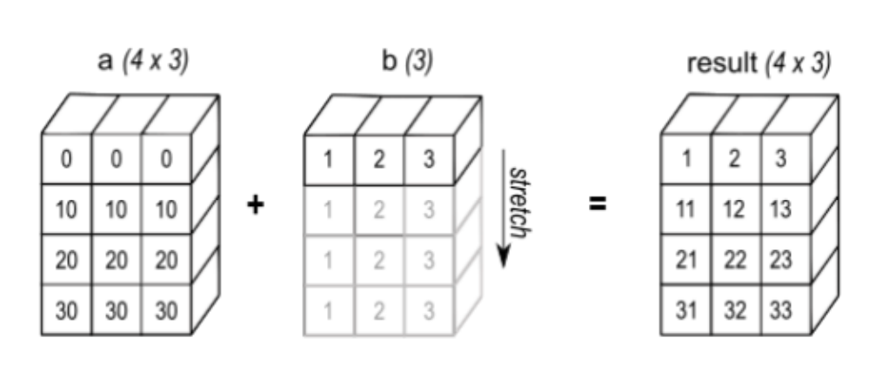

# Day 4: The Art of Pointer Arithmetic

Welcome to Day 4 of the GPU Challenge!

On [**Day 3**](./day-3.md), we wrote our first CUDA kernel. We learned about the host-device relationship, the `__global__` keyword, and the fundamental pattern of allocating memory on the GPU, copying data to it, launching a kernel, and copying the result back.

Today, we take a step back from the kernel code itself to look at the data we're operating on. Before we can speed up our kernels, we must understand how multi-dimensional arrays, or *tensors*, are actually arranged in the computer's flat, one-dimensional memory. Mastering this is the key to unlocking powerful, zero-copy operations that are critical for performance.

### The Illusion of Dimensions

The first thing to realize is that a 2D matrix or a 3D tensor is an illusion. All data in your computer's memory, from the CPU's RAM to the GPU's VRAM, is stored as one long, contiguous, 1D array. The "shape" of a tensor is just a convenient abstraction for us humans. The system needs a precise way to map a multi-dimensional index like `(row, col)` to a single offset in that 1D array.

There are two common ways to do this:

*   **Row-Major Order (C-style):** This is the layout used by C, C++, and Python libraries like NumPy and PyTorch. You store all of row 0, followed by all of row 1, and so on. It's like reading a book—left to right, then top to bottom.
*   **Column-Major Order (Fortran-style):** This layout stores all of column 0, then all of column 1, and so on.

### The Magic of Strides

So how does a program know how to jump to the next row? It uses **strides**. A stride is an array that tells you how many elements you need to skip in the 1D memory array to move one step along a particular dimension.

Formally, the memory location of an element `(i, j, k, ...)` is calculated as:

`memory_index = base_offset + (i * stride_i) + (j * stride_j) + (k * stride_k) + ...`

Let's take a 3x4 matrix stored in row-major order:
*   **Shape:** `[3, 4]` (3 rows, 4 columns)
*   **Strides:** `[4, 1]`
    *   To move one step in dimension 0 (from one row to the next), you must skip **4** elements in memory (the length of a full row).
    *   To move one step in dimension 1 (from one column to the next), you just skip **1** element.

If it were column-major, the strides would be `[1, 3]`.

### The Payoff: Zero-Copy Operations

This stride system seems like simple bookkeeping, but it enables incredibly efficient operations without copying any data. By simply manipulating the metadata (shape, strides, and starting offset), we can create "views" of tensors that behave like entirely new tensors.

#### Slicing Without Copying

Imagine you have a 4x5 matrix `A` and you want to create a 3x2 sub-matrix starting at `A[1, 2]`. Instead of allocating new memory and copying the values, you can just create a new tensor view with updated metadata:

*   **Original Matrix A:**
    *   Shape: `[4, 5]`
    *   Strides (row-major): `[5, 1]`
    *   Data: `[a00, a01, ..., a34]`

*   **New Sub-Matrix View:**
    *   **New Shape:** `[3, 2]`
    *   **New Offset:** The starting element is `A[1, 2]`. In a row-major layout, its memory index is `(1 * stride_row) + (2 * stride_col)` = `(1 * 5) + (2 * 1)` = `7`.
    *   **New Strides:** The way you navigate this sub-matrix is the same as the original. To get to the next row in the slice, you still have to jump over a full row of the *original* matrix. So, the strides remain `[5, 1]`.

No data was moved. We just told the system: "Start reading from index 7, and pretend you're looking at a matrix, but use strides of to find the elements."

#### Transposing for Free

Transposing a matrix is even simpler. You swap the shape and the strides. More generally speaking, transposition is just a permutation of the tensor's strides, which reorders how dimensions are accessed.

*   **Original Matrix A:** Shape `[m, n]`, Strides `[n, 1]`
*   **Transposed View A.T:** Shape `[n, m]`, Strides `[1, n]`

Again, zero data is copied. The underlying 1D array of numbers is untouched. We've only changed how we *interpret* it.

#### Broadcasting with a Zero Stride

This is the most mind-bending trick. How do you add a `[4, 3]` matrix and a `[1, 3]` vector? The naive way is to physically copy the vector four times to create a matching `[4, 3]` matrix.

The smart way is to use strides. For the vector (shape `[1, 3]`), we can tell the system to "expand" it into a `[4, 3]` view by setting the stride of the new dimension to **zero**.

*   **Original Vector `b`:**
    *   Shape: `[3]` (let's think of it as `[1, 3]`)
    *   Strides: `[1]` (or `[3, 1]` if we're explicit)
*   **Broadcasted View of `b`:**
    *   New Shape: `[4, 3]`
    *   New Strides: `[0, 1]`

When the system calculates the address for `A[i, j]`, it does `offset + (i * 0) + (j * 1)`. Notice that the `i` (the row index) is multiplied by zero! No matter which row `i` you ask for, you always get sent back to the start of that same single row of data.

### The "Contiguous" Pitfall

These zero-copy views are powerful, but they come with a catch: the data in the view may no longer be **contiguous** in memory. A transposed matrix is a classic example. While each row *in the view* is logically coherent, its elements are scattered across the original 1D memory block.

Many low-level GPU operations are heavily optimized for contiguous memory access to maximize bandwidth. When they encounter a non-contiguous view, they might perform poorly or fail altogether. This is why frameworks like PyTorch have a `.contiguous()` method. Calling it checks if the memory is already contiguous. If not, it performs a physical copy to create a new, contiguous tensor, effectively "materializing" the view.

### What's Next

We've now covered the basics of launching a kernel (Day 3) and the memory layout of the data it will process (Day 4). We are finally ready to combine these concepts to write a *fast* kernel. On Day 5, we will dive into one of the most important operations in all of deep learning—matrix multiplication (MatMul)—and begin our journey of optimizing it, starting with a technique called tiling.

### Suggested Readings

1.  [**The *Tensor* Part of "PyTorch Internals" by Edward Yang**](https://blog.ezyang.com/2019/05/pytorch-internals/): As we progress, we’ll do a lot of indexing into strided in-memory representations of matrices. Edward’s post contains a clear, foundational explanation of how libraries like PyTorch use strides to represent tensors of any dimension.

2.  [**Interactive Stride Visualizer**](https://ezyang.github.io/stride-visualizer/index.html): A fantastic interactive tool by Edward Yang that helps you calculate stride access patterns and understand the pointer arithmetic involved.