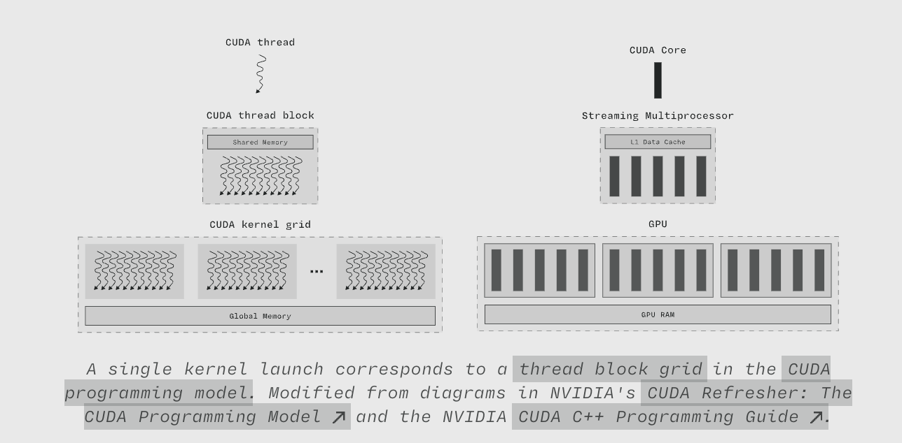
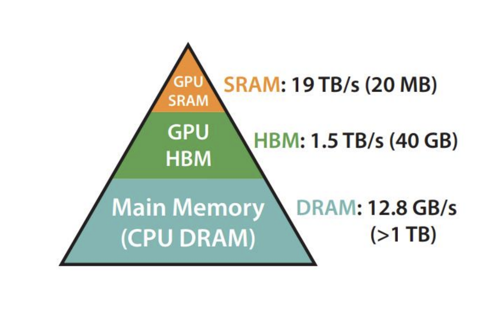
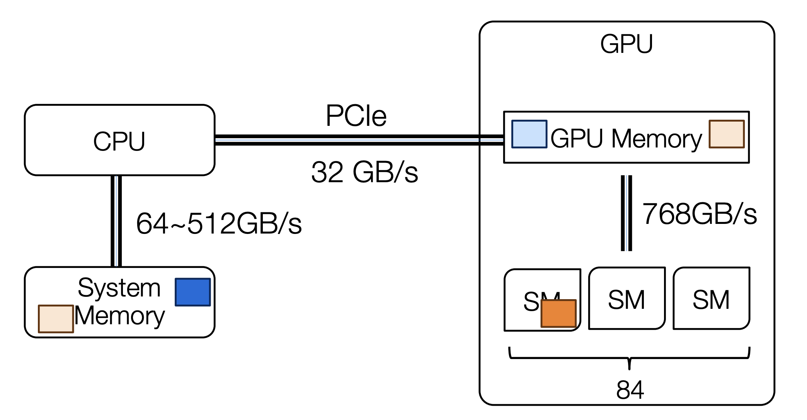
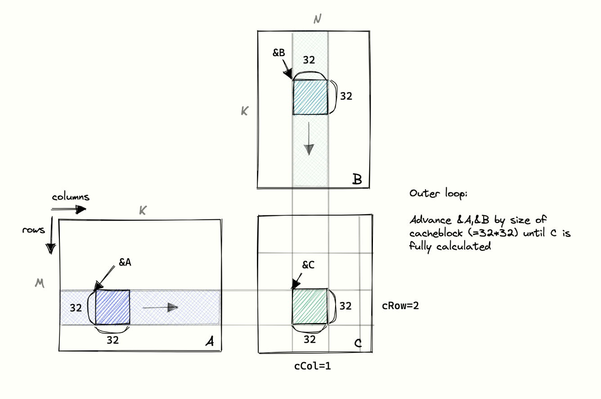

# Day 5: Tiling and Shared Memory

Welcome to Day 5 of the GPU Challenge!

On [**Day 4**](./day-4.md), we demystified the tensor. We learned that multi-dimensional arrays are an illusion built upon a flat, 1D memory space and that `strides` are the magic that allows for powerful, zero-copy operations like slicing and transposing.

Today, we combine our knowledge of kernel launches ([**Day 3**](./day-3.md)) and memory layouts ([**Day 4**](./day-4.md)) to tackle our first major performance optimization. We will optimize the single most important operation in deep learning: **Matrix Multiplication (MatMul)**. Our goal is to stop starving the GPU and start feeding it the high-density compute it craves. To do this, we'll learn to use one of the most powerful tools in the CUDA programmer's arsenal: **shared memory**.

To begin, let's recap how the CUDA programming model maps to the underlying GPU hardware hierarchies.

<div align="center">

</div>
<div align="center">
<b>Figure 1:</b> Mapping of CUDA programming model constructs (Grid, Block, Thread) to GPU hardware (Chip, SM, SP). (Source: Modal.com, The GPU Glossary)
</div>

### The Problem with Naive MatMul

Let's start with the most straightforward MatMul kernel. For a MatMul `C = A * B`, each thread is responsible for calculating a single element `C[i, j]`. To do this, it computes the dot product of row `i` from matrix `A` and column `j` from matrix `B`.

```c++
__global__ void naiveMatmul(float *A, float *B, float *C, int N) {
    // Each thread computes one element of C
    int row = blockIdx.y * blockDim.y + threadIdx.y;
    int col = blockIdx.x * blockDim.x + threadIdx.x;

    if (row < N && col < N) {
        float value = 0;
        // Dot product of row from A and column from B
        for (int k = 0; k < N; k++) {
            value += A[row * N + k] * B[k * N + col];
        }
        C[row * N + col] = value;
    }
}
```

This looks simple and correct, but it's disastrous for performance. Why? Because it's completely memory-bound.

Think about the data each thread needs. To compute `C[0, 0]`, the thread reads the entire first row of A and the entire first column of B. To compute `C[0, 1]`, the very next thread *also reads the entire first row of A*. This is incredibly wasteful. We're reading the same elements from slow global memory repeatedly.

We can quantify this using a concept called **Arithmetic Intensity (AI)**, which is the ratio of arithmetic operations to memory operations.

**Arithmetic Intensity = (Total Floating-Point Operations) / (Total Bytes Accessed from Global Memory)**

For our naive kernel, the AI is very low. We do a lot of reading for very little computing. Our GPU's powerful processing cores spend most of their time idle, waiting for data to arrive from the slow, off-chip global memory (DRAM).

<div align="center">

</div>
<div align="center">
<b>Figure 2:</b> The GPU memory hierarchy, highlighting the trade-off between speed and size. (Source: Dao et al., FlashAttention)
</div>

<div align="center">

</div>
<div align="center">
<b>Figure 3:</b> Illustration of data transfer speeds between CPU and GPU memory. (Source: Large Language Model Systems, CMU 11868)
</div>

### The Solution: Tiling with Shared Memory

The solution is to exploit the memory hierarchy. We need to load data from slow global memory *once*, store it in a much faster on-chip memory, and reuse it many times. In CUDA, this fast, on-chip, user-managed cache is called **Shared Memory**.

Shared memory is a small (typically 48-96 KB per block) RAM shared by all threads within a single thread block. It's orders of magnitude faster than global memory. The strategy, known as **tiling** or **blocking**, is as follows:

1.  Divide the large matrices A and B into smaller sub-matrices, or **tiles**.
2.  Each thread block becomes responsible for computing one tile of the output matrix C.
3.  To do this, the block collaboratively loads the necessary tiles from A and B out of slow **global memory** and into fast **shared memory**.
4.  Crucially, all threads in the block must synchronize to ensure the tiles are fully loaded before computation begins.
5.  The block's threads then perform the MatMul on the tiles, reading exclusively from the ultra-fast shared memory.
6.  Once the output tile is computed, it's written back to global memory.

This completely changes the Arithmetic Intensity. We perform one slow read from global memory for each element in a tile, but then we reuse that element for many computations within the block.

<div align="center">

</div>
<div align="center">
<b>Figure 4:</b> Tiled Matrix Multiplication. An output tile of C is computed by iteratively multiplying tiles from A and B. (Source: Simon Boehm, How to Optimize a CUDA Matmul Kernel for cuBLAS-like Performance: a Worklog)
</div>

### A Tiled MatMul Kernel

Here's what the tiled implementation looks like. It's more complex, but the performance gains are enormous.

```c++
#define TILE_DIM 16 // The dimension of the square tiles

__global__ void tiledMatmul(float *A, float *B, float *C, int N) {
    // 1. Declare tiles in fast shared memory
    __shared__ float tile_A[TILE_DIM][TILE_DIM];
    __shared__ float tile_B[TILE_DIM][TILE_DIM];

    // Thread's coordinates within the grid and block
    int row = blockIdx.y * TILE_DIM + threadIdx.y;
    int col = blockIdx.x * TILE_DIM + threadIdx.x;
    
    // Thread's local coordinates within the block
    int ty = threadIdx.y;
    int tx = threadIdx.x;

    float C_value = 0;

    // 2. Loop over the tiles of A and B required to compute the C tile
    for (int t = 0; t < N / TILE_DIM; t++) {
        // 3. COLLABORATIVE LOAD: Each thread loads one element
        // of tile_A and tile_B from global to shared memory.
        tile_A[ty][tx] = A[row * N + (t * TILE_DIM + tx)];
        tile_B[ty][tx] = B[(t * TILE_DIM + ty) * N + col];

        // 4. SYNCHRONIZE: Wait for all threads in the block to finish
        // loading their part of the tiles before proceeding.
        __syncthreads();

        // 5. COMPUTE: Perform the dot product using the fast shared memory.
        // Each thread accumulates partial sums for its output element.
        for (int k = 0; k < TILE_DIM; k++) {
            C_value += tile_A[ty][k] * tile_B[k][tx];
        }

        // 6. SYNCHRONIZE AGAIN: Ensure all computations using the current
        // tiles are finished before the next loop iteration loads new ones.
        __syncthreads();
    }

    // 7. Write the final result for this thread to global memory
    if (row < N && col < N) {
        C[row * N + col] = C_value;
    }
}
```

Let's break down the key new elements:
*   `__shared__ float tile_A[TILE_DIM][TILE_DIM];`: This declares a 2D array that will reside in the fast shared memory of the block. All threads in the block can read and write to it.
*   **Collaborative Loading**: Each thread calculates its global `row` and `col` and uses them to load just *one* element of A and *one* element of B into the correct position in the shared memory tiles. This is a classic parallel programming pattern: divide the loading work among the team.
*   `__syncthreads();`: This is a barrier and is absolutely critical. It forces every thread in the block to pause at this line until all of its sibling threads have also reached it. This guarantees that `tile_A` and `tile_B` are completely populated before any thread tries to use them for computation. Forgetting to synchronize is a common and difficult-to-debug error.
*   **Computation from Shared Memory**: The inner `k` loop now only runs `TILE_DIM` times. More importantly, every read `tile_A[ty][k]` and `tile_B[k][tx]` hits the fast shared memory, not the slow global memory. This is where the massive speedup comes from.

### What's Next

We've made a huge leap in performance by fundamentally changing our algorithm to be more cache-friendly. Tiling is one of the most important concepts in high-performance GPU computing. But we're not done yet.

Our tiled kernel is much better, but it's still not perfect. Are we accessing global memory in the most efficient way possible? Are there conflicts when threads try to access shared memory simultaneously? How can we make the computation itself even more efficient?

Next, we'll dive deeper into memory access patterns and learn about **memory coalescing**, another key optimization to ensure we are using every last bit of available memory bandwidth.

### Suggested Readings

1.  [**How to Optimize a CUDA Matmul Kernel for cuBLAS-like Performance: a Worklog by Simon Boehm**](https://siboehm.com/articles/22/CUDA-MMM): A beautifully illustrated guide that shows general techniques for improving the performance of a matrix multiplication kernel in CUDA step-by-step.
2.  [**The GPU Glossary by Modal**](https://modal.com/gpu-glossary/readme): A well-organized, curated documentation regarding every detail of GPU knowledge.
3.  [**CUDA C++ Programming Guide: Shared Memory**](https://docs.nvidia.com/cuda/cuda-c-programming-guide/index.html#shared-memory): The official NVIDIA documentation provides the ground truth on how shared memory works, including its benefits and potential pitfalls like bank conflicts, which we will visit later.