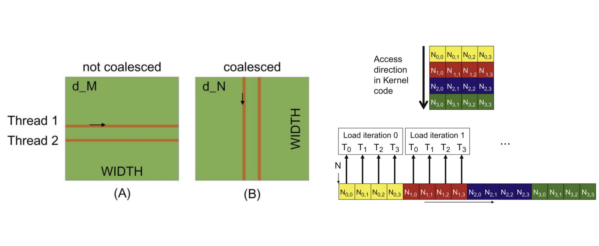

# Day 6: Global Memory coalescing

Welcome to Day 6 of the GPU Challenge!

On [**Day 5**](./day-5.md), we took a massive leap forward by optimizing our matrix multiplication kernel. We used **tiling** and **shared memory** to reduce our trips to slow global memory, drastically improving our kernel's Arithmetic Intensity and overall performance.

We successfully loaded data into the fast on-chip shared memory, computed on it, and wrote the results back. But a nagging question remains: Are we loading that data in the most efficient way possible? It turns out that ***how*** **you access global memory is just as important as** ***how often***.

Today, we dive into one of the most critical low-level performance concepts in GPU programming: **Memory Coalescing**. This is the key to unlocking the full bandwidth of your GPU's memory system and can lead to performance improvements of over 4x on its own.

-----

### The GPU's Thirst for Data

Modern GPUs are embarrassingly parallel, featuring thousands of cores ready to crunch numbers. To feed these hungry cores, the GPU memory system is designed for massive throughput, not low latency. It’s like a giant fire hose, not a surgical squirt gun—it excels at moving huge, contiguous chunks of data all at once.

This is achieved through a powerful hardware feature. When a group of threads asks for data from global memory (DRAM), the hardware doesn't fetch one byte at a time. Instead, it performs a **DRAM burst**, grabbing a whole segment of memory (e.g., 32, 64, or 128 bytes) in a single transaction.

This is where the **warp** comes in. A warp is a group of 32 threads that execute instructions in lockstep (a concept known as SIMT, or Single Instruction, Multiple Thread). When the threads in a warp request data from global memory, the GPU's memory controller examines their requests. If all 32 threads are accessing adjacent, aligned memory locations, the hardware can **"coalesce"** these 32 individual requests into one single, wide memory transaction. This is the ideal scenario—a **coalesced access**.

<div align="center">

</div>
<div align="center">
<b>Figure 1:</b> Coalesced vs. Uncoalesced Memory Access. When threads in a warp access contiguous memory, the hardware issues one efficient transaction. When they access scattered locations, it results in multiple, inefficient transactions.
(Source: Large Language Model Systems, CMU 11868)
</div>

What happens if the access is *not* coalesced? If the threads in a warp access scattered, non-contiguous memory locations (a "strided" or "random" access pattern), the hardware can't bundle the requests. It's forced to issue multiple, smaller, and far less efficient memory transactions. The result? The warp stalls, the memory bus is underutilized, and performance plummets. A simple kernel can see its global memory throughput drop from over 110 GB/s to a mere 15 GB/s due to this issue alone.

-----

### Uncoalesced Access in Our Tiled Kernel

Let's revisit our tiled MatMul kernel from Day 5. We were so focused on using shared memory that we might have overlooked a subtle but deadly performance bug.

```c++
#define TILE_DIM 16

__global__ void tiledMatmul(float *A, float *B, float *C, int N) {
    __shared__ float tile_A[TILE_DIM][TILE_DIM];
    __shared__ float tile_B[TILE_DIM][TILE_DIM];

    int row = blockIdx.y * TILE_DIM + threadIdx.y;
    int col = blockIdx.x * TILE_DIM + threadIdx.x;
    
    int ty = threadIdx.y;
    int tx = threadIdx.x;

    // ... (loop and C_value initialization) ...

    // COLLABORATIVE LOAD
    // Access for tile_A: Coalesced!
    tile_A[ty][tx] = A[row * N + (t * TILE_DIM + tx)];
    // Access for tile_B: Uncoalesced! ☠️
    tile_B[ty][tx] = B[(t * TILE_DIM + ty) * N + col];

    // ... (synchronization and computation) ...
}
```

Let's analyze the two global memory loads. Remember that matrices are stored in memory in **row-major** order.

1.  **Loading `tile_A`**: The memory address is `A[row * N + (t * TILE_DIM + tx)]`.

      * `row` depends on `threadIdx.y`.
      * The second part depends on `threadIdx.x` (`tx`).
      * Threads with consecutive `threadIdx.x` values (e.g., thread (0,0), (0,1), (0,2)...) will access consecutive memory locations `A[...], A[...+1], A[...+2]`. This is a **perfectly coalesced** access pattern along a row of matrix A. 👍

2.  **Loading `tile_B`**: The memory address is `B[(t * TILE_DIM + ty) * N + col]`.

      * The row index `(t * TILE_DIM + ty)` depends on `threadIdx.y` (`ty`).
      * The column index `col` depends on `threadIdx.x`.
      * Consider two adjacent threads in a warp: thread (0,0) and thread (0,1). They have the same `threadIdx.y` but different `threadIdx.x`.
          * Thread (0,0) accesses `B[...]`
          * Thread (0,1) accesses `B[... + 1]`
      * Now consider two other adjacent threads: thread (0,0) and thread (1,0). They have the same `threadIdx.x` but different `threadIdx.y`.
          * Thread (0,0) accesses `B[some_row * N + col]`
          * Thread (1,0) accesses `B[(some_row + 1) * N + col]`
      * These two addresses are separated by `N` elements in memory\! This is a **strided access** down a column of matrix B. Each thread in the warp is accessing a different row, resulting in terrible memory performance. 👎

We are efficiently reading rows from matrix `A` but very inefficiently reading columns from matrix `B`.

-----

### The Fix: A Smarter Load

How do we fix this? We can't change the fact that we need a row from `A` and a column from `B`. The trick is to change our loading strategy so that all global memory reads are row-wise (coalesced).

The problem is how we are loading `tile_B`. We want each thread to load data for `B` just like it does for `A`—by reading along a row. But the `tile_B` in shared memory needs to be arranged as if it were read column-wise for the MatMul logic to work.

The solution? Load `B` row-wise from global memory, but write it into the shared memory tile *transposed*.

```c++
#define TILE_DIM 16

__global__ void coalescedTiledMatmul(float *A, float *B, float *C, int N) {
    __shared__ float tile_A[TILE_DIM][TILE_DIM];
    __shared__ float tile_B[TILE_DIM][TILE_DIM];

    int row = blockIdx.y * TILE_DIM + threadIdx.y;
    int col = blockIdx.x * TILE_DIM + threadIdx.x;

    int ty = threadIdx.y;
    int tx = threadIdx.x;

    float C_value = 0;

    for (int t = 0; t < N / TILE_DIM; t++) {
        // COLLABORATIVE, COALESCED LOAD
        // Load tile_A (same as before, it was already good)
        tile_A[ty][tx] = A[row * N + (t * TILE_DIM + tx)];
        
        // Load tile_B: Read a row from B, write it as a column in shared memory.
        // Each thread now reads a contiguous element from a row of B.
        tile_B[tx][ty] = B[(t * TILE_DIM + ty) * N + col];
        
        // Let's re-index B to make the access pattern clear.
        // Global row for B is `(t * TILE_DIM + ty)`
        // Global col for B is `col`, which is `(blockIdx.x * TILE_DIM + tx)`
        // So B's global index is `B_global_row * N + B_global_col`
        // Let's re-write the B load to be explicitly coalesced.
        int B_load_row = t * TILE_DIM + ty;
        int B_load_col = blockIdx.x * TILE_DIM + tx;
        tile_B[ty][tx] = B[B_load_row * N + B_load_col]; // Now this is a coalesced read!

        __syncthreads();

        // COMPUTE (remains the same)
        for (int k = 0; k < TILE_DIM; k++) {
            C_value += tile_A[ty][k] * tile_B[k][tx];
        }

        __syncthreads();
    }

    if (row < N && col < N) {
        C[row * N + col] = C_value;
    }
}
```

Let's look closely at the corrected load for `B`:
`tile_B[ty][tx] = B[(t * TILE_DIM + ty) * N + (blockIdx.x * TILE_DIM + tx)];`

The global memory address being read from `B` now depends on `threadIdx.y` for its row component and `threadIdx.x` for its column component. Just like with matrix `A`, threads with consecutive `threadIdx.x` values will now read consecutive elements from a row of `B`. We have successfully achieved a coalesced read for both matrices\! The performance jump from this change alone can be substantial, taking a kernel from \~300 GFLOPs/s to nearly 2000 GFLOPs/s.

The subsequent computation loop `C_value += tile_A[ty][k] * tile_B[k][tx];` is unaffected because it operates purely on shared memory, which does not have the same coalescing rules as global memory (though it has its own performance characteristics, like bank conflicts, which we'll visit later).

-----

### Takeaway

By paying close attention to the details of hardware, we've transformed a hidden performance bottleneck into a highly efficient data pipeline. Memory coalescing is a fundamental skill for any GPU programmer. It effectively reduces the number of load/store instructions issued, so fewer cycles are needed and less time-consuming memory traffic occurs. Always ask yourself: "Are the threads in my warp accessing contiguous memory?" 🙂


### Suggested Readings

1.  [**How to Optimize a CUDA Matmul Kernel for cuBLAS-like Performance: a Worklog by Simon Boehm**](https://siboehm.com/articles/22/CUDA-MMM): A beautifully illustrated guide that shows general techniques for improving the performance of a matrix multiplication kernel in CUDA step-by-step.
2.  [**4.5x Faster CUDA C with just Two Variable Changes || Episode 3: Memory Coalescing**](http://www.youtube.com/watch?v=QmKNE3viwIE): A concise video demonstrating the dramatic impact of memory coalescing with a simple code change.