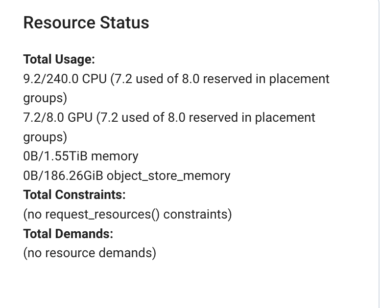
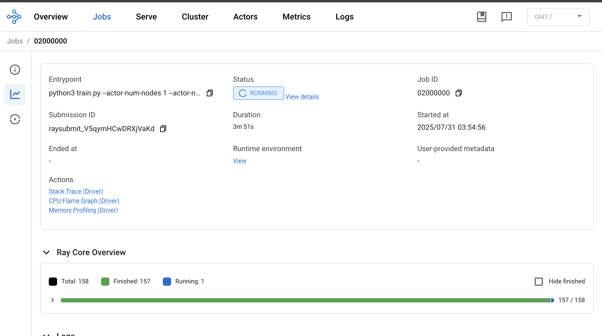
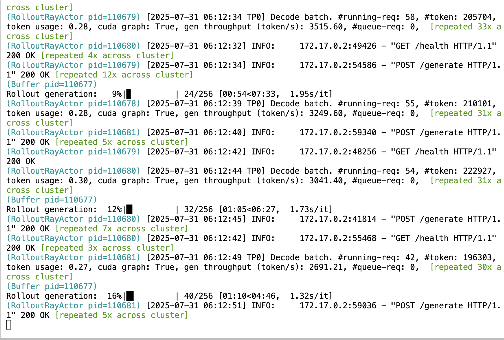

# Day 9: A Log of Setting Up Slime

Welcome to Day 9 of our GPU Challenge!

Following up on the introduction to the RL for LLM post-training at [**Day 8**](./day-8.md), today is all about getting our hands dirty. I'm logging my experience setting up an LLM post-training experiment using [Slime](https://github.com/THUDM/slime), a powerful framework for reinforcement learning (RL) scaling. Our goal is to post-train the `Qwen3-4B` model on a hefty 8x A100 GPU machine.

### What's Ray Doing?

Think of a massive, complex task like training a huge language model. You have an orchestra of powerful GPUs ready to play, but they all need to work in perfect harmony. Ray is your conductor. You, the scientist, provide the sheet music—your Python code and high-level logic. Ray takes that music and intelligently distributes it among the musicians (the GPUs). It tells each GPU which part of the data to process, when to process it, and how to combine their results. It manages all the behind-the-scenes communication and coordination, ensuring that if one musician stumbles (a process fails), the whole performance doesn't grind to a halt. In short, Ray lets you focus on the science of your model, while it handles the complex engineering of making it all run seamlessly across a powerful cluster of machines.

Now, let's get to the setup.

### Step 1: Entering the Environment

First, we need to get into a pre-configured environment. The `zhuzilin/slime:latest` Docker image is perfect as it comes with `Megatron` and `SGLang` already installed. We run a container from this image, giving it access to all host GPUs and setting up the necessary shared memory.

```bash
sudo docker run --rm --gpus all --ipc=host --shm-size=16g \
  --ulimit memlock=-1 --ulimit stack=67108864 \
  -p 8265:8265 \
  -it zhuzilin/slime:latest /bin/bash
```

This command starts an interactive terminal session inside the container, and we've also preemptively mapped port 8265, which we'll use later for the Ray dashboard.

### Step 2: Cloning Slime and Installing Dependencies

Once inside the container, the next log entry is to grab the Slime source code from GitHub and install it in editable mode.

```bash
cd /root/
git clone https://github.com/THUDM/slime.git
cd /root/slime
pip install -e .
```

### Step 3: Preparing Models and Datasets

We can't train without data and a base model. We'll use `huggingface-cli` to download everything we need. First, you'll need to log in with an [access token](https://huggingface.co/settings/tokens) from your Hugging Face account.

```bash
hf auth login
```

With authentication sorted, we download the `Qwen3-4B` model checkpoint, along with the training and evaluation datasets.

Dataset Hugging Face Page: [AIME-2024](https://huggingface.co/datasets/zhuzilin/aime-2024)

```bash
# Download the Qwen3-4B model checkpoint
hf download Qwen/Qwen3-4B --local-dir /root/Qwen3-4B

# Download the training data
hf download --repo-type dataset zhuzilin/dapo-math-17k \
  --local-dir /root/dapo-math-17k

# Download the evaluation data
hf download --repo-type dataset zhuzilin/aime-2024 \
  --local-dir /root/aime-2024
```

The downloaded Hugging Face checkpoint isn't directly compatible with `Megatron-LM`. We need to convert it. The `Slime` repository contains a handy script for this.

```bash
cd /root/slime
source scripts/models/qwen3-4B.sh
PYTHONPATH=/root/Megatron-LM python tools/convert_hf_to_torch_dist.py \
    ${MODEL_ARGS[@]} \
    --hf-checkpoint /root/Qwen3-4B \
    --save /root/Qwen3-4B_torch_dist
```

### Step 4: Launching the Training

Before kicking off the main event, we need to make one small but crucial tweak. To access the Ray dashboard from our local machine, we have to tell it to listen on all network interfaces, not just localhost inside the container.

I modified the `scripts/run-qwen3-4B.sh` file, changing the `ray start` command to:

```bash
ray start --head --node-ip-address ${MASTER_ADDR} --num-gpus 8 --disable-usage-stats --dashboard-host=0.0.0.0 --dashboard-port=8265
```

With that change saved, it's time to run the training script.

```bash
cd /root/slime
bash scripts/run-qwen3-4B.sh
```

This script initiates the Ray cluster and begins the post-training process.

### Step 5: Monitoring with the Ray Dashboard via SSH Tunnel

The training is now running on the remote 8x A100 machine, inside a Docker container. To see what's going on, we'll connect to the Ray dashboard. This requires creating an SSH tunnel from our local laptop to the remote machine.

Here’s the command I ran on my local laptop's terminal:

```bash
ssh -L 8265:localhost:8265 -N ubuntu@xxx.xxx.xx.x # Repalce with your onw GPU instance IP
```

Let's break that down:
*   `-L 8265:localhost:8265`: This is the local port forwarding instruction. It tells SSH to forward traffic from port `8265` on my local machine to `localhost:8265` on the remote server (`xxx.xxx.xx.x`). Since our Docker container has mapped its port `8265` to the server's port `8265`, this effectively creates a secure tunnel right to the Ray dashboard.
*   `-N`: This flag tells SSH not to execute a remote command, which is useful since we only care about the port forwarding.
*   `ubuntu@xxx.xxx.xx.x`: The standard SSH user and host.

The flow of the connection looks like this:
`Your Laptop's Browser (localhost:8265) → SSH Tunnel → Remote VM → Docker Container's Ray Dashboard (Port 8265)`

With the tunnel active, I can simply open a web browser on my laptop and navigate to `http://localhost:8265`. There it is! The Ray dashboard appears, and I can monitor the resource usage, logs, and progress of our LLM post-training job.


<div align="center">

</div>
<div align="center">
<b>Figure 1:</b> Ray Dashboard Cluster Info
</div>


<div align="center">

</div>
<div align="center">
<b>Figure 2:</b> Ray Dashboard Job Overview
</div>


<div align="center">

</div>
<div align="center">
<b>Figure 3:</b> Remote Terminal Log
</div>


### Suggested Readings

https://github.com/THUDM/slime/blob/main/docs/en/models/qwen3-4B.md